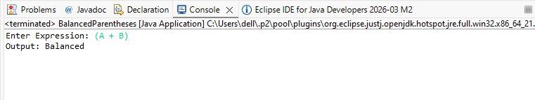

# Balanced Parentheses Program in Java (Using Stack)

## Problem Statement
Write a Java program to check whether a given expression has balanced parentheses using Stack.

---

## Java Program

```java
import java.util.Scanner;
import java.util.Stack;

public class BalancedParentheses {

    public static boolean isBalanced(String expression) {
        Stack<Character> stack = new Stack<>();

        for (int i = 0; i < expression.length(); i++) {
            char ch = expression.charAt(i);

            // If opening bracket, push into stack
            if (ch == '(' || ch == '{' || ch == '[') {
                stack.push(ch);
            }

            // If closing bracket
            else if (ch == ')' || ch == '}' || ch == ']') {
                if (stack.isEmpty()) {
                    return false;
                }

                char top = stack.pop();

                // Check matching pair
                if ((ch == ')' && top != '(') ||
                    (ch == '}' && top != '{') ||
                    (ch == ']' && top != '[')) {
                    return false;
                }
            }
        }

        // If stack is empty, parentheses are balanced
        return stack.isEmpty();
    }

    public static void main(String[] args) {
        Scanner sc = new Scanner(System.in);

        System.out.print("Enter expression: ");
        String expression = sc.nextLine();

        if (isBalanced(expression)) {
            System.out.println("Expression is Balanced");
        } else {
            System.out.println("Expression is NOT Balanced");
        }

        sc.close();
    }
}
```

## OUTPUT : 
