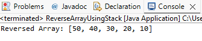

# Reverse an Array Using Stack


## Problem Statement
Given an integer array, use stack to reverse the array elements.

---

## Java Program

```java

public class ReverseArrayUsingStack {

    public static void main(String[] args) {

        int[] arr = {10, 20, 30, 40, 50};

        Stack<Integer> stack = new Stack<>();

        // Push all elements into stack
        for (int i = 0; i < arr.length; i++) {
            stack.push(arr[i]);
        }

        // Pop elements back into array
        for (int i = 0; i < arr.length; i++) {
            arr[i] = stack.pop();
        }

        // Print reversed array
        System.out.println("Reversed Array: " + Arrays.toString(arr));
    }
}

```

## OUTPUT :

