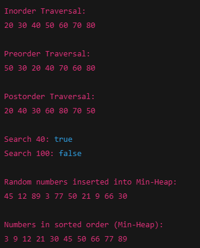

```java
import java.util.PriorityQueue;
import java.util.Random;

// Node class for BST
class Node {
    int data;
    Node left, right;

    Node(int value) {
        data = value;
        left = right = null;
    }
}

class BinarySearchTree {
    Node root;

    // Insert into BST
    Node insert(Node root, int value) {
        if (root == null) {
            return new Node(value);
        }

        if (value < root.data) {
            root.left = insert(root.left, value);
        } else if (value > root.data) {
            root.right = insert(root.right, value);
        }

        return root;
    }

    // Search in BST
    boolean search(Node root, int key) {
        if (root == null)
            return false;

        if (root.data == key)
            return true;

        if (key < root.data)
            return search(root.left, key);
        else
            return search(root.right, key);
    }

    // Inorder Traversal (Left, Root, Right)
    void inorder(Node root) {
        if (root != null) {
            inorder(root.left);
            System.out.print(root.data + " ");
            inorder(root.right);
        }
    }

    // Preorder Traversal (Root, Left, Right)
    void preorder(Node root) {
        if (root != null) {
            System.out.print(root.data + " ");
            preorder(root.left);
            preorder(root.right);
        }
    }

    // Postorder Traversal (Left, Right, Root)
    void postorder(Node root) {
        if (root != null) {
            postorder(root.left);
            postorder(root.right);
            System.out.print(root.data + " ");
        }
    }
}

public class BSTAndHeapAssignment {

    public static void main(String[] args) {

        // -------------------- TASK 1 --------------------
        BinarySearchTree bst = new BinarySearchTree();
        int[] elements = {50, 30, 70, 20, 40, 60, 80};

        for (int value : elements) {
            bst.root = bst.insert(bst.root, value);
        }

        // -------------------- TASK 2 --------------------
        System.out.println("Inorder Traversal:");
        bst.inorder(bst.root);

        System.out.println("\nPreorder Traversal:");
        bst.preorder(bst.root);

        System.out.println("\nPostorder Traversal:");
        bst.postorder(bst.root);

        // -------------------- TASK 3 --------------------
        System.out.println("\n\nSearch 40: " + bst.search(bst.root, 40));
        System.out.println("Search 100: " + bst.search(bst.root, 100));

        // -------------------- TASK 4 & 5 --------------------
        PriorityQueue<Integer> minHeap = new PriorityQueue<>();
        Random random = new Random();

        System.out.println("\nRandom numbers inserted into Min-Heap:");

        for (int i = 0; i < 10; i++) {
            int num = random.nextInt(100);
            minHeap.add(num);
            System.out.print(num + " ");
        }

        System.out.println("\n\nNumbers in sorted order (Min-Heap):");

        while (!minHeap.isEmpty()) {
            System.out.print(minHeap.poll() + " ");
        }
    }
}

```

## OUTPUT




# Binary Search Tree (BST) and Min-Heap Explanation

---

## 1️⃣ Insert Operation (BST)

Elements are inserted according to the **BST property**:

- Left subtree → values smaller than root  
- Right subtree → values greater than root  

### Example:

- 50 becomes root  
- 30 goes to left of 50  
- 70 goes to right of 50  

This property is maintained for every node in the tree.

---

## 2️⃣ Traversals

### 🔹 Inorder (Left → Root → Right)

- Visits left subtree first
- Then root node
- Then right subtree
- Gives **sorted output** in BST

**Output:**
20 30 40 50 60 70 80


---

### 🔹 Preorder (Root → Left → Right)

- Visits root first
- Then left subtree
- Then right subtree
- Used to copy/clone tree

**Output:**
50 30 20 40 70 60 80


---

### 🔹 Postorder (Left → Right → Root)

- Visits left subtree
- Then right subtree
- Then root
- Used to delete/free tree

**Output:**
20 40 30 60 80 70 50


---

## 3️⃣ Search Operation (BST)

Search is performed by comparing the value with the root:

- If equal → Found  
- If smaller → Search left subtree  
- If larger → Search right subtree  

### Example:

- Searching 40 → **Found (true)**  
- Searching 100 → **Not found (false)**  

---

## 4️⃣ Min-Heap using Java PriorityQueue

Java provides built-in Min-Heap using:

```java
PriorityQueue<Integer> minHeap = new PriorityQueue<>();
```

- Smallest element is always at the top.

- poll() removes elements in sorted order.

✅ Time Complexity Analysis

Binary Search Tree (BST)

| Operation | Average Case | Worst Case |
| --------- | ------------ | ---------- |
| Insert    | O(log n)     | O(n)       |
| Search    | O(log n)     | O(n)       |
| Traversal | O(n)         | O(n)       |


Min-Heap (PriorityQueue)

| Operation               | Time Complexity |
| ----------------------- | --------------- |
| Insert                  | O(log n)        |
| Delete (poll)           | O(log n)        |
| Peek                    | O(1)            |
| Build Heap (n elements) | O(n)            |
